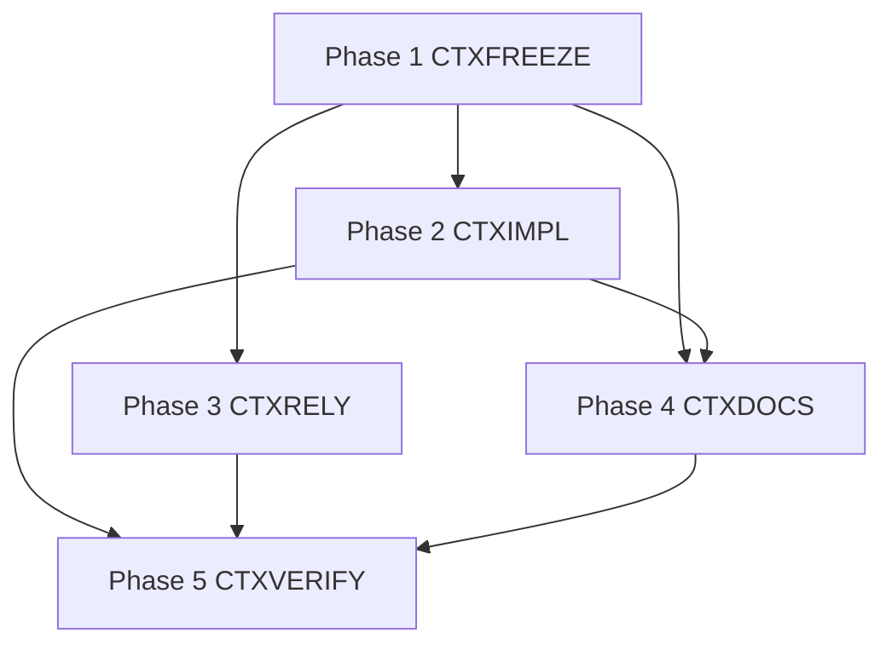

# Phase roadmap v6

## Context

GitHub issue [#114](https://github.com/ViperJuice/agent-harness/issues/114) exposed a real advisor-panel ingestion gap: callers need to give the panel local files by reference without reading private or very large file contents into the rendered artifact/prompt. The existing `artifact_ref` name is overloaded and historically means "read this path and stage the bytes"; it keeps caller context lean, but it still inlines document contents into the panel bundle. The EZBidPro PWA/PBS/NavBlue workflow needs a stricter boundary: the panel should receive a path/metadata manifest and inspect files through local tools only when a leg has that capability.

The current branch, `fix/panel-context-refs-gemini-retry-timeouts-114`, already contains candidate work for `context_refs`, Gemini retry-once behavior, and per-leg timeout overrides. This roadmap treats that work as a candidate implementation to audit, harden, document, and release. It does not assume the branch is correct until the interface gates and verification phases pass.

The older detailed plan, `plans/detailed-artifact-by-reference-ingestion-20260706-0618.md`, is historical for privacy semantics: it remains useful for `artifact_ref`/`brief_ref` back-compat tests, but it is superseded by this roadmap wherever it describes read-file-and-stage behavior as true by-reference ingestion.

## Architecture North Star

Advisor-panel ingestion has three explicit modes with distinct safety semantics:

- Inline artifact text: the caller supplies review text directly.
- Read-file-and-stage refs: the runtime reads path contents and stages them as bundle bytes for back-compat.
- True by-reference context refs: the runtime validates local paths and stages only metadata plus instructions; referenced file contents are not automatically copied into the rendered bundle or prompt by the runtime.

The true by-reference mode is a first-class API, not a documentation trick. It must work through `invoke_panel`, `invoke_board`, and `PanelRequest`, preserve existing golden behavior, and fail closed unless the caller explicitly opts into soft warning metadata for missing/unreadable context.

## Assumptions

- Panel legs may have local filesystem access when launched from the same machine, but this is not guaranteed for every future backing.
- Back-compat for `artifact`, `artifact_ref`, and `brief_ref` is required because governed gates and existing skills depend on current staging behavior.
- Issue #114 is scoped to reference ingestion and panel reliability around stalled legs; it is not a general Advisor Board redesign.
- Private source material must be protected by default; tests should prove sentinel document content is absent from staged artifacts.
- Pathnames, filenames, and hashes can themselves be sensitive. The frozen contract must explicitly decide which metadata is staged and whether integrity metadata such as full SHA-256 is worth the privacy exposure.

## Non-Goals

- No replacement of the Advisor Board v5 model-first roadmap.
- No new external storage service for private artifacts.
- No automatic upload, redistribution, or summarization of referenced file contents.
- No guarantee that every provider can inspect local files; unsupported backings should fail or degrade explicitly.
- No general output-DLP guarantee in #114 unless CTXFREEZE explicitly adds one; by default, #114 prevents runtime auto-inlining, not agent-authored disclosure after a leg chooses to inspect a file.
- No final release dispatch in the prepare phase; release triggering remains a separate human or release-dispatch action.

## Cross-Cutting Principles

- Names must match behavior: do not call read-file-and-stage behavior "by reference" without qualification.
- Metadata-only by default for private context references.
- Metadata is still disclosure. The manifest must avoid unnecessary path/hash leakage and must make its privacy boundary explicit.
- Golden back-compat is load-bearing: existing `invoke_panel(artifact, legs)` behavior must remain byte-stable.
- Fail closed at trust boundaries, with opt-in soft warning only where explicitly modeled.
- Verification must include negative proof that private file bytes were not staged and a clear boundary for what happens after a leg intentionally reads a referenced file.

## Top Interface-Freeze Gates

- IF-0-CTXFREEZE-1 — Ingestion API contract: `artifact`, `artifact_ref`, `brief_ref`, and true by-reference `context_refs` semantics, precedence, failure behavior, and supported entry points are frozen.
- IF-0-CTXFREEZE-2 — Context-ref manifest contract: metadata fields, ordering, contents-only non-inlining guarantee, path normalization, root/symlink/TOCTOU policy, structured escaping, streaming/bounded metadata extraction, untrusted MIME/extension handling, optional PDF page count, and local-tool instruction text are frozen.
- IF-0-CTXFREEZE-3 — Panel reliability contract: per-leg timeout override naming, request threading, Gemini/agy transient retry policy, and non-retry hard-timeout semantics are frozen or explicitly split to a non-blocking follow-on.
- IF-0-CTXDOCS-1 — Documentation and skill contract: advisor-panel/board skills and contract docs distinguish inline, read-file-and-stage, and true by-reference modes without implying private bytes are safe to paste.
- IF-0-CTXVERIFY-1 — Release proof contract: regression tests include sentinel absence, golden back-compat, missing-path behavior, timeout threading, retry bounds, and docs freshness.

## Phases

### Phase 1 — Contract Audit And Freeze (CTXFREEZE)

**Objective**

Freeze the #114 ingestion and reliability contracts before accepting or extending the current branch implementation.

**Exit criteria**
- [ ] The public API contract names all ingestion modes and entry points: `invoke_panel`, `invoke_board`, and `PanelRequest`.
- [ ] Precedence rules are documented for `artifact`, `artifact_ref`, `brief_ref`, and `context_refs`.
- [ ] Missing/unreadable context-ref behavior is specified as fail-closed by default with explicit soft-warning opt-in.
- [ ] Provider/local-filesystem assumptions are recorded for current homebrew legs and future backings.
- [ ] Candidate branch behavior is compared against the frozen contract and any mismatches are listed before implementation cleanup begins.
- [ ] The privacy claim is narrowed or expanded deliberately: either "runtime does not auto-stage referenced file contents" or a stronger output policy with sentinel checks across `PanelResult`, logs, observer events, handoffs, and verification artifacts.
- [ ] The manifest contract defines structured escaping, relative-path base, path normalization, symlink policy, root escape behavior, non-regular file rejection, TOCTOU-safe stat/open/hash sequencing, and behavior for very large/sparse/virtual files.
- [ ] Hashing, MIME sniffing, and PDF page counting are bounded and streaming where possible; extension-derived MIME values are labeled as untrusted hints unless magic-byte sniffing is implemented.
- [ ] Soft-warning missing/unreadable entries include a strict "do not infer or guess contents" instruction and a heterogeneous-entry contract for missing hashes/metadata.
- [ ] `PanelRequest.brief_ref` is either added with tests or explicitly excluded from the entry-point contract and docs.
- [ ] The `timeouts_by_leg` versus `timeout_seconds_by_leg` naming split is either reconciled or deliberately frozen with a rationale.
- [ ] `context_refs` behavior for non-local/remote provider backings is decided: skip/degrade explicitly or documented limitation with visible warning.
- [ ] `CONTRACTS.md` is corrected during the freeze so `artifact_ref` is no longer described as true non-inlining.

**Scope notes**

Three lanes: contract/spec lane for API semantics and safety language; file-boundary lane for manifest, filesystem, metadata, and output-boundary policy; branch-audit lane for comparing current #114 code/tests against that spec.

**Non-goals**

No runtime edits beyond documentation comments needed to clarify the frozen contract.

**Key files**

- `phase-loop-runtime/src/phase_loop_runtime/panel_invoker.py`
- `phase-loop-runtime/src/phase_loop_runtime/advisor_board/CONTRACTS.md`
- `phase-loop-runtime/tests/test_panel_context_refs_114.py`
- `phase-loop-runtime/tests/test_panel_invoker.py`

**Depends on**

- (none)

**Produces**

- IF-0-CTXFREEZE-1
- IF-0-CTXFREEZE-2
- IF-0-CTXFREEZE-3

**Spec closeout policy**

- schema: `spec_delta_closeout.v1`
- expected_decision: `canonical_spec_update`
- target_surfaces: `phase_loop_runtime.panel_invoker`, `advisor_board.CONTRACTS`
- evidence_paths: `phase-loop-runtime/src/phase_loop_runtime/advisor_board/CONTRACTS.md`, `phase-loop-runtime/tests/test_panel_context_refs_114.py`
- redaction_posture: `metadata_only`
- blocker_class: `contract_bug` when API semantics or evidence paths are missing/malformed

### Phase 2 — Runtime Implementation And Back-Compat (CTXIMPL)

**Objective**

Implement or repair the runtime so true by-reference context refs are available without changing existing inline and read-file-and-stage behavior.

**Exit criteria**
- [ ] `context_refs` reaches every supported entry point and renders a manifest without reading referenced file contents into the bundle.
- [ ] `artifact_ref` and `brief_ref` retain their existing read-file-and-stage behavior and are named/documented accurately.
- [ ] Context-ref manifests include deterministic path and metadata entries while excluding file bodies.
- [ ] Missing paths fail closed by default and soft warning mode produces explicit unreadable metadata without pretending the file was reviewed.
- [ ] Metadata extraction is bounded and avoids full-file memory reads for large files; non-regular files and unsupported filesystem cases follow the frozen policy.
- [ ] Manifest rendering uses escaped structured data or an equivalent injection-resistant format.
- [ ] Remote/non-local seats either skip/degrade explicitly for `context_refs` or display the frozen limitation clearly.
- [ ] Existing golden/back-compat tests for default panel behavior still pass unchanged.

**Scope notes**

Three lanes: API-threading lane for entry points and dataclasses; manifest lane for metadata rendering and sentinel exclusion; back-compat lane for preserving existing artifact/brief staging and golden behavior.

**Non-goals**

No provider redesign and no attempt to make remote/provider backings magically read local files.

**Key files**

- `phase-loop-runtime/src/phase_loop_runtime/panel_invoker.py`
- `phase-loop-runtime/tests/test_panel_context_refs_114.py`
- `phase-loop-runtime/tests/test_advisor_board_golden.py`
- `phase-loop-runtime/tests/test_panel_invoker.py`

**Depends on**

- CTXFREEZE

**Produces**

- (none)

**Spec closeout policy**

- schema: `spec_delta_closeout.v1`
- expected_decision: `canonical_spec_update`
- target_surfaces: `phase_loop_runtime.panel_invoker`, `PanelRequest`
- evidence_paths: `phase-loop-runtime/tests/test_panel_context_refs_114.py`, `phase-loop-runtime/tests/test_advisor_board_golden.py`
- redaction_posture: `metadata_only`
- blocker_class: `contract_bug` when sentinel non-inlining proof or golden proof is absent

### Phase 3 — Reliability Bounds (CTXRELY)

**Objective**

Bound panel hangs and transient leg loss discovered alongside #114 so large/private-document panel runs are usable in practice. This phase is same-branch hardening, but it is not required for the minimal #114 context-ref release unless CTXFREEZE deliberately declares it in scope.

**Exit criteria**
- [ ] Per-leg timeout overrides thread through `invoke_panel`, `invoke_board`, and `PanelRequest`.
- [ ] Unspecified legs continue to use the existing input-scaled timeout behavior.
- [ ] Gemini/agy retries exactly once on soft/transient empty or stall signals.
- [ ] Hard subprocess timeouts and hard non-transient errors do not retry.
- [ ] Retry elapsed-time guards prevent a soft-empty retry from doubling a slow leg's wall-clock budget.

**Scope notes**

Two lanes: timeout-threading lane for API and spawn boundaries; transient-classification lane for Gemini/agy retry and elapsed guards. These can run after CTXFREEZE in parallel with CTXIMPL if the frozen reliability contract is stable. CTXVERIFY may proceed without CTXRELY only if CTXFREEZE records CTXRELY as a follow-on and removes reliability acceptance from the #114 release checklist.

**Non-goals**

No global scheduler rewrite and no multi-leg cancellation framework.

**Key files**

- `phase-loop-runtime/src/phase_loop_runtime/panel_invoker.py`
- `phase-loop-runtime/tests/test_panel_context_refs_114.py`
- `phase-loop-runtime/tests/test_panel_invoker_timeout_argv.py`
- `phase-loop-runtime/tests/test_panel_invoker_spawn.py`

**Depends on**

- CTXFREEZE

**Produces**

- (none)

**Spec closeout policy**

- schema: `spec_delta_closeout.v1`
- expected_decision: `no_spec_delta`
- target_surfaces: `phase_loop_runtime.panel_invoker`
- evidence_paths: `phase-loop-runtime/tests/test_panel_context_refs_114.py`, `phase-loop-runtime/tests/test_panel_invoker_spawn.py`
- redaction_posture: `metadata_only`
- blocker_class: `contract_bug` when timeout/retry behavior cannot be machine-checked

### Phase 4 — Docs, Skills, And Migration Language (CTXDOCS)

**Objective**

Align user-facing skills and docs so future callers choose the safe ingestion mode and understand the limits of each mode.

**Exit criteria**
- [ ] Advisor-panel and advisor-board skill docs lead with `context_refs` for large/private materials.
- [ ] Docs stop describing `artifact_ref` as true non-inlining and instead call it read-file-and-stage behavior.
- [ ] Capability docs list the three ingestion modes and when to use each.
- [ ] Docs warn that pathnames and hashes can disclose sensitive information, and that agents may disclose file contents after they intentionally inspect referenced files unless an output policy forbids it.
- [ ] Docs explain provider/backing limitations for local file references.
- [ ] Changelog/release notes describe the #114 behavior without exposing private examples or raw file contents.
- [ ] Migration examples show path/metadata-only usage and warn that unsupported remote backings may not have local file access.

**Scope notes**

Three lanes: runtime contract docs, bundled skill docs, and release/migration notes. Docs can begin after CTXFREEZE and finish after CTXIMPL confirms final API names.

**Non-goals**

No private EZBidPro/PWA/PBS/NavBlue content in docs or examples.

**Key files**

- `phase-loop-runtime/src/phase_loop_runtime/advisor_board/CONTRACTS.md`
- `phase-loop-runtime/src/phase_loop_runtime/skills_bundle/*advisor-panel*/SKILL.md`
- `phase-loop-runtime/src/phase_loop_runtime/skills_bundle/*advisor-board*/SKILL.md`
- `skills-src/*/*advisor-board*/SKILL.md`
- `docs/advisor-board-capabilities-card.md`
- `CHANGELOG.md`

**Depends on**

- CTXFREEZE
- CTXIMPL

**Produces**

- IF-0-CTXDOCS-1

**Spec closeout policy**

- schema: `spec_delta_closeout.v1`
- expected_decision: `dotfiles_skill_source_update`
- target_surfaces: `skills_bundle`, `skills-src`, `advisor_board.CONTRACTS`, `CHANGELOG`
- evidence_paths: `phase-loop-runtime/src/phase_loop_runtime/skills_bundle`, `skills-src`, `docs/advisor-board-capabilities-card.md`
- redaction_posture: `metadata_only`
- blocker_class: `contract_bug` when docs contradict runtime behavior

### Phase 5 — Verification, PR Closeout, And Release Prep (CTXVERIFY)

**Objective**

Run release-grade verification, reconcile current branch state, prepare PR closeout, and leave release dispatch as an explicit separate action.

**Exit criteria**
- [ ] Sentinel non-inlining tests pass and prove referenced file contents are absent from staged bundles.
- [ ] `invoke_board(..., context_refs=[p])` has a behavior test proving sentinel bytes are absent while path/metadata follows the frozen manifest contract.
- [ ] A manifest snapshot/golden test pins field ordering, escaping, and heterogeneous missing/unreadable entries.
- [ ] Filesystem edge tests cover relative paths, `..`, symlink handling, symlink escape, non-regular files, spoofed extensions/MIME hints, and large/sparse file metadata behavior as frozen in CTXFREEZE.
- [ ] Golden advisor-board and panel-invoker tests pass for back-compat.
- [ ] Timeout/retry tests pass and cover retry bounds.
- [ ] Roadmap and issue #114 acceptance criteria are reconciled into a concise PR checklist.
- [ ] Any unrelated worktree changes, including generated lockfiles or local indices, are classified before staging.
- [ ] Release-prep verification includes full standalone pytest excluding dotfiles integration, clean-room install gate, skill canon parity, generated skill no-op/diff check, and `git diff --check`, or equivalent green GitHub checks before merge.
- [ ] Release-prep notes identify what can merge now and what requires a separate release-dispatch phase.

**Scope notes**

Two lanes: verification lane for targeted and broader test commands; closeout lane for PR/issue checklist, staging hygiene, and release-prep notes.

**Non-goals**

No direct release publishing, no force push, and no deletion of unrelated local files.

**Key files**

- `phase-loop-runtime/tests/test_panel_context_refs_114.py`
- `phase-loop-runtime/tests/test_advisor_board_golden.py`
- `phase-loop-runtime/tests/test_panel_invoker.py`
- `CHANGELOG.md`
- `specs/phase-plans-v6.md`

**Depends on**

- CTXIMPL
- CTXRELY
- CTXDOCS

**Produces**

- IF-0-CTXVERIFY-1

**Spec closeout policy**

- schema: `spec_delta_closeout.v1`
- expected_decision: `no_spec_delta`
- target_surfaces: `verification_artifacts`, `issue_114_pr_checklist`
- evidence_paths: `.phase-loop`, `.dev-skills/handoffs`, `phase-loop-runtime/tests`
- redaction_posture: `metadata_only`
- blocker_class: `contract_bug` when release proof omits sentinel absence or golden back-compat

## Phase Dependency DAG



## Execution Notes

CTXFREEZE is the serial first phase. After that, CTXIMPL and CTXRELY can be planned independently if the contract is stable. CTXDOCS can start from the frozen contract but should not close until CTXIMPL finalizes the API names. CTXVERIFY is the serial release-prep gate. CTXRELY is optional for the minimal #114 context-ref release if CTXFREEZE explicitly splits timeout/retry work to follow-on scope; otherwise CTXVERIFY depends on it as shown in the DAG.

Current branch note: `fix/panel-context-refs-gemini-retry-timeouts-114` appears to contain a candidate implementation commit for this roadmap. Downstream phase plans should begin by diffing that branch against the frozen CTXFREEZE contract rather than reimplementing from scratch.

Next phase: CTXFREEZE - Contract Audit And Freeze

Next command: `codex-plan-phase specs/phase-plans-v6.md CTXFREEZE`

## Verification

```bash
phase-loop validate-roadmap specs/phase-plans-v6.md
cd phase-loop-runtime
PYTHONPATH=src python3 -m pytest tests/test_panel_context_refs_114.py -q
PYTHONPATH=src python3 -m pytest tests/test_advisor_board_golden.py -q
PYTHONPATH=src python3 -m pytest tests/test_panel_invoker.py tests/test_panel_invoker_spawn.py -q
PYTHONPATH=src python3 -m pytest tests/ -q -k 'panel or advisor_board'
PYTHONPATH=src python3 -m pytest -m "not dotfiles_integration"
PYTHONPATH=src python3 -m pytest -q tests/test_skills_canon_parity.py
bash scripts/gate_a_cleanroom.sh
git diff --check
```
